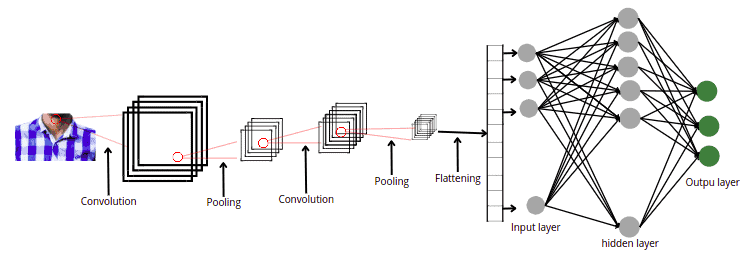

# Reconocimiento de Emociones en Perros

Este proyecto tiene como objetivo desarrollar un sistema de reconocimiento de emociones en perros utilizando técnicas de aprendizaje profundo, específicamente redes neuronales convolucionales (CNN). Se busca crear un modelo capaz de identificar las emociones principales en imágenes de perros, tales como felicidad, tristeza, ira y relajación.

## Conjunto de Datos Utilizado

Para este proyecto, se utilizó el conjunto de datos "Dog Emotion" disponible en Kaggle. Este conjunto de datos contiene imágenes etiquetadas con diferentes emociones de perros, lo que lo hace ideal para el entrenamiento de modelos de reconocimiento de emociones en perros.

Puedes encontrar el conjunto de datos en el siguiente enlace: [Dog Emotion Dataset](https://www.kaggle.com/datasets/danielshanbalico/dog-emotion)

## Redes Neuronales Convolucionales (CNN)

Las redes neuronales convolucionales (CNN) son un tipo de red neuronal artificial diseñada específicamente para el procesamiento de datos de imágenes. Las CNN son altamente efectivas en tareas de reconocimiento de patrones visuales debido a su capacidad para capturar y aprender jerarquías de características en imágenes.

### Estructura de una CNN

Una CNN está compuesta por múltiples capas, incluyendo:

- **Capas Convolucionales:** Estas capas aplican filtros a regiones específicas de la imagen para extraer características, como bordes, texturas y formas. Cada filtro produce un "mapa de características" que resalta una característica específica en la imagen.
  
- **Capas de Agrupación (Pooling):** Estas capas reducen la dimensionalidad de las características extraídas, lo que ayuda a reducir el costo computacional y el riesgo de sobreajuste. Las operaciones de agrupación suelen ser de máximo o promedio, y reducen el tamaño de las características preservando su información más relevante.

- **Capas Completamente Conectadas:** Estas capas utilizan las características extraídas por las capas anteriores para realizar la clasificación final. Cada neurona en estas capas está conectada a todas las neuronas de la capa anterior, lo que permite capturar relaciones más complejas entre las características.

### Proceso de Aprendizaje

Durante el entrenamiento, una CNN aprende automáticamente a reconocer patrones visuales mediante el proceso de propagación hacia atrás (backpropagation). Durante la propagación hacia atrás, la red ajusta los pesos de sus conexiones para minimizar una función de pérdida, que mide la discrepancia entre las etiquetas de las emociones reales y las predicciones del modelo.

### Aplicaciones de las CNN

Las CNN se utilizan en una amplia variedad de aplicaciones de visión por computadora, incluyendo reconocimiento de objetos, clasificación de imágenes, detección de rostros, segmentación de imágenes y más. En este proyecto específico, se utilizan para el reconocimiento de emociones en imágenes de perros, pero su versatilidad las hace adecuadas para una variedad de tareas relacionadas con el procesamiento de imágenes.

## Proceso del Proyecto

### Preparación del Entorno y Descarga de Datos

Se comienza instalando las bibliotecas necesarias y descargando el conjunto de datos desde Kaggle utilizando la biblioteca `opendatasets`. Este conjunto de datos contiene imágenes etiquetadas con diferentes emociones de perros.

### Exploración y Visualización de Datos

Se exploran las imágenes descargadas para comprender la estructura del conjunto de datos y visualizar algunas imágenes de muestra de cada emoción.

### Preprocesamiento de Datos

Las imágenes se preprocesan para adaptarlas al formato adecuado para la entrada del modelo CNN. Esto incluye convertir las imágenes a escala de grises, redimensionarlas y normalizar sus valores de píxeles.

### ¿Qué es un Modelo CNN?

Un modelo de red neuronal convolucional (CNN) es un tipo de red neuronal artificial diseñada específicamente para el procesamiento de datos de imágenes. Las CNN son altamente efectivas en tareas de reconocimiento de patrones visuales debido a su capacidad para capturar y aprender jerarquías de características en imágenes.

Las CNN están compuestas por múltiples capas, incluyendo capas convolucionales, de agrupación y completamente conectadas. Las capas convolucionales aplican filtros a regiones específicas de la imagen para extraer características, como bordes, texturas y formas. Las capas de agrupación reducen la dimensionalidad de las características extraídas, mientras que las capas completamente conectadas las utilizan para realizar la clasificación final.

### Entrenamiento del Modelo CNN

Se entrena un modelo de CNN utilizando TensorFlow y Keras. El modelo se entrena con las imágenes preprocesadas y las etiquetas de las emociones correspondientes. Se utiliza un conjunto de técnicas de aumento de datos para mejorar el rendimiento del modelo y evitar el sobreajuste.

### Evaluación del Modelo

Se evalúa el rendimiento del modelo utilizando un conjunto de datos de prueba separado. Se calcula la precisión del modelo en la clasificación de las emociones de los perros.

### Visualización de Resultados

Se visualizan los resultados del modelo, incluidas las métricas de precisión y pérdida a lo largo del entrenamiento, así como ejemplos de imágenes de prueba con sus emociones predichas.

### Predicción en Nuevas Imágenes

Finalmente, se proporciona una función para realizar predicciones en nuevas imágenes de perros. El modelo entrenado se carga y se utiliza para predecir la emoción en la imagen proporcionada.

### Implementación de la Interfaz Web

Después de guardar el modelo entrenado, se implementó una interfaz web utilizando HTML y JavaScript. El archivo `index.html` se abre localmente en un servidor web utilizando el comando `python -m http.server 8080`. Luego, se utiliza ngrok para crear un túnel HTTP y obtener un enlace público que se puede utilizar en diferentes dispositivos para interactuar con la aplicación de reconocimiento de emociones en perros.

## Objetivo Final

El objetivo final de este proyecto es desarrollar un sistema de reconocimiento de emociones en perros que pueda ser utilizado para diversas aplicaciones, como la detección de emociones en entornos de cuidado de mascotas o la creación de aplicaciones interactivas para propietarios de mascotas.
